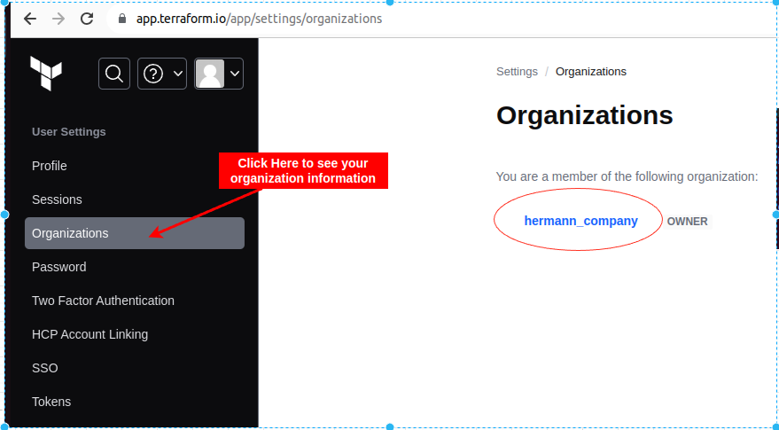

# Learn Terraform data sources

Learn how Terraform data sources help you import data into your Terraform configuration : 

- Terraform data sources let you __dynamically fetch data__ from APIs or other Terraform state backends.
- Examples of data sources include machine image IDs from a cloud provider or Terraform outputs from other configurations
- Data sources make your configuration more flexible and dynamic and let you reference values from other configurations, helping you scope your configuration while still referencing any dependent resource attributes.

### Goal : 
- In this tutorial, you will use data sources to make your configuration more dynamic. 

### Prerequisites
For this tutorial, you will need:
- Terraform v1.2+ installed locally.
- a Terraform Cloud account and organization. [Click here](https://app.terraform.io/public/signup/account?utm_source=learn) to create a Cloud or to login on it if your already have one
- Terraform Cloud locally authenticated. [Click here](https://developer.hashicorp.com/terraform/tutorials/cloud-get-started/cloud-login) to see the process
- The AWS CLI.
- a Terraform Cloud variable set configured with your AWS credentials.

## Open the Folders
The example configuration for this tutorial is hosted in two Folders : __data-sources-vpc__ and __data-sources-app__ inside the folder called __data-sources__

1. The VPC repository contains the configuration to deploy a VPC and security groups for your application : code in __data-sources-vpc__ folder

2. The application repository contains the configuration to deploy an example application consisting of a load balancer and an EC2 instance : code in __data-sources-app__ 

## Initialize VPC workspace
- Change to the VPC repository directory.
```
cd data-sources-vpc
```
- Set the TF_CLOUD_ORGANIZATION environment variable to your Terraform Cloud organization name. __This will configure your Terraform Cloud integration.__
    * Open your Terraform Cloud account and copy your Organization name
        

    * Open the Terminal and export your cloud organization name like environment variable. 
        ```
            # export TF_CLOUD_ORGANIZATION=Your_Terraform_Cloud_Organization in my case
            export TF_CLOUD_ORGANIZATION=hermann_company
        ```
- make terraform login command, your terraform cloud are open. Then copy and paste your token in the terminal
    ```
    terraform login
    ```
- Initialize your configuration. Terraform will automatically create the workspace in your Terraform Cloud organization.
     ```
        terraform init
    ```

## Update VPC region
The VPC configuration uses a variable called aws_region with a default value of us-east-1 to set the region.

However, changing the value of the aws_region variable will not successfully change the region because the VPC configuration includes an azs argument to set Availability Zones, which is a hard-coded list of availability zones in the us-east-1 region.

    ```
    module "vpc" {
        ##...
        azs             = ["us-east-1a", "us-east-1b", "us-east-1c", "us-east-1d", "us-east-1e"]
        ##...
    }
    ```

- Use the aws_availability_zones data source to load the available AZs for the current region. Add the following to main.tf.

    ```
        data "aws_availability_zones" "available" {
            state = "available"

            filter {
                name   = "zone-type"
                values = ["availability-zone"]
            }
        }

    ```
- ou can reference data source attributes with the pattern data.<NAME>.<ATTRIBUTE>. Update the VPC configuration to use this data source to set the list of availability zones.

    ```
        module "vpc" {
            source  = "terraform-aws-modules/vpc/aws"
            version = "3.14.0"

            cidr = var.vpc_cidr_block

            azs             = data.aws_availability_zones.available.names
            private_subnets = slice(var.private_subnet_cidr_blocks, 0, 2)
            public_subnets  = slice(var.public_subnet_cidr_blocks, 0, 2)

            ##...
        }
    ```

- onfigure the VPC workspace to output the region, which the application workspace will require as an input. Add a data source to __main.tf__ to access region information.

    ```
        data "aws_region" "current" { }
    ```
    * Add an output for the region to __outputs.tf__.

        ```
            output "aws_region" {
                description = "AWS region"
                value       = data.aws_region.current.name
            }
        ```
## Create infrastructure
Apply this configuration, setting the value of aws_region to us-west-1. Respond to the confirmation prompt with a yes.
    ```
        terraform apply -var aws_region=us-west-1
    ```

# Configure Terraform remote state

- Now that you deployed your network resources, go to the __data-sources-app__ directory.
    
    ```
        cd ../data-sources-app
    ```
* This directory contains the Terraform configuration for your application.

    - Initialize your configuration. 
    - Terraform will automatically create the __data-sources-app__ workspace in your Terraform Cloud organization.

#### Like the VPC workspace, this configuration includes hard-coded values for the us-east-1 region. You can use the terraform_remote_state data source to use another Terraform workspace's output data.

- Add a __terraform_remote_state__ data source to the __main.tf__ file inside the __data-sources-app__ directory
- replacing YOUR_ORG with your own Terraform Cloud organization name.

    ```
        data "terraform_remote_state" "vpc" {
            backend = "remote"

            config = {
                organization = "YOUR_ORG"
                    workspaces = {

                        name   = "data-sources-vpc"
                    }
            }
        }
    ```
- This remote state block uses the remote backend to load state data from the workspace and organization in the config section.
- For security purposes, you must explicitly allow Terraform Cloud workspaces to access one another's state. 
- To allow your __data-sources-app__ workspace to access your __data-sources-vpc__ workspace's state:

1. Log in to Terraform Cloud.
2. Choose the organization you are using for this tutorial.
3. Navigate to your __data-sources-vpc__ workspace.
4. In the workspace's General Settings, find the Remote state sharing section.
5. Select the Share with specific workspaces option and choose the __data-sources-app__ workspace.
6. Click the Save settings button.

- Now, update your aws provider configuration in __main.tf__ to use the same region as the VPC configuration instead of a hardcoded region.

    ```
        provider "aws" {
            region = data.terraform_remote_state.vpc.outputs.aws_region
        }
    ```
- The VPC configuration also included outputs for subnet and security group IDs. 
- Configure the load balancer security group and subnet arguments for the __elb__ module with those values.

    ```
        module "elb_http" {
            ##...
            security_groups = data.terraform_remote_state.vpc.outputs.lb_security_group_ids
            subnets         = data.terraform_remote_state.vpc.outputs.public_subnet_ids
            ##...
        }
    ```

## Scale EC2 instances
- You can use values from data sources just like any other Terraform values, including by passing them to functions. 
- The configuration in __main.tf__ only uses a single EC2 instance. 
- Update the configuration to use the __instances_per_subnet__ variable to provision multiple EC2 instances per __subnet__.

    ```
        resource "aws_instance" "app" {
            ##...
            count = var.instances_per_subnet * length(data.terraform_remote_state.vpc.outputs.private_subnet_ids)

            ami = "ami-04d29b6f966df1537"
            ##...
        }
    ```
- Now when you apply this configuration, Terraform will provision __var.instances_per_subnet__ instances for each private subnet configured in your VPC workspace.

## Configure region-specific AMIs
- The AWS instance configuration also uses a hard-coded AMI ID, which is only valid for the __us-east-1__ region. 
- Use an aws_ami data source to load the correct AMI ID for the current region. Add the following to __main.tf__.

    ```
        data "aws_ami" "amazon_linux" {
            most_recent = true
            owners      = ["amazon"]

            filter {
                name   = "name"
                values = ["amzn2-ami-hvm-*-x86_64-gp2"]
            }
        }
    ```
- Replace the hard-coded AMI ID with the one loaded from the new data source.

    ```
        resource "aws_instance" "app" {
            count = var.instances_per_subnet * length(data.terraform_remote_state.vpc.outputs.private_subnet_ids)

            ami = data.aws_ami.amazon_linux.id

            ##...
        }
    ```
## Configure EC2 subnet and security groups
- Finally, update the EC2 instance configuration to use the subnet and security group configuration from the VPC workspace.
    
    ```
        resource "aws_instance" "app" {
            ##...

            subnet_id              = data.terraform_remote_state.vpc.outputs.private_subnet_ids[count.index % length(data.terraform_remote_state.vpc.outputs.private_subnet_ids)]
            vpc_security_group_ids = data.terraform_remote_state.vpc.outputs.app_security_group_ids

            ##...
        }
    ```
- Apply the configuration and Terraform will provision the application infrastructure. 
- Respond to the confirmation prompt with a yes.
    
    ```
    terraform apply
    ```
- After a few minutes, the load balancer health checks will pass, and will return the example response.

    ```
        curl $(terraform output -raw lb_url)
    ```
## Clean up your infrastructure
- Before moving on, destroy the infrastructure you created in this tutorial.

- In the application directory, destroy the application infrastructure. Respond to the confirmation prompt with yes.

    ```
        terraform destroy
    ```
- Now change to the VPC directory.
    
    ```
        cd ../data-sources-vpc
    ```
- Destroy this infrastructure as well. Once again, respond to the confirmation prompt with yes.
    ```
        terraform destroy -var aws_region=us-west-1
    ```
- If you used Terraform Cloud for this tutorial, after destroying your resources, delete the __data-sources-vpc__ and __data-sources-app__ workspaces from your Terraform Cloud organization.

# Next steps
- In this tutorial, you used data sources to make your configuration more dynamic. 
- You deployed two separate configurations for your application and network resources and used the __terraform_remote_state__ data source to share data between them. 
- You also replaced __region-specific__ configuration with dynamic values from AWS provider data sources.
- Now that you have used Terraform data sources, check out the following resources for more information.