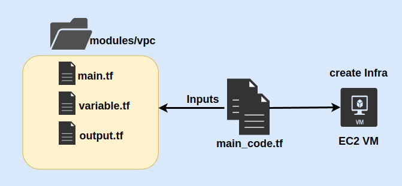

# Terraform-associate-class

## Project Description

### ABOUT THIS LAB

Terraform modules are a good way to abstract out repeated chunks of code, making it reusable across other Terraform projects and configurations. 

In this hands-on lab, we'll be writing a basic Terraform module (Local System Module) from scratch and then testing it out.

In this Lab, we'll create a local VPC module, pass an AWS region to this module, then retrieve the subnet created through the module and the AMI ID to create an EC2 instance.

